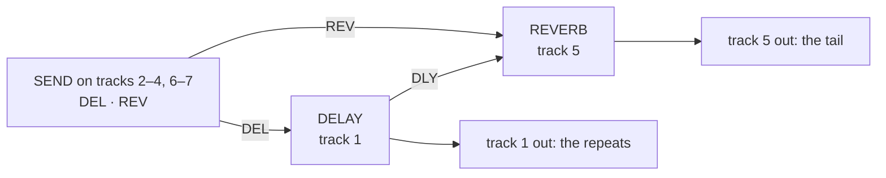

# bottleservice

A remix of Octatrack OS 1.40C, built from your own copy of it, that adds:

- a **delay and reverb bus** with a send from every track, and three new
  FX1 effects (a filter, a drive pedal and a modulation pedal);
- **scene locks and parameter locks on page 2** and a TEMPO window that
  edits the bus engines;
- **USB MIDI** and **USB audio** (the master track into a computer) over the
  Octatrack's own USB port;
- **KITS**: 255 Kits per project; each pattern plays its Kit.

Named after the set it is built for. Runs on an MKII; see [Where it has
run](#where-it-has-run). Each module has its own page with the technical
detail; this page says what you get and how to put it on the unit.

## The effects

### The bus

Every track's FX2 slot takes part in one delay-and-reverb chain. Tracks 1
and 5 host the two engines; every other track has a SEND with two knobs,
DEL and REV, that set how much of the track goes to each. The delay's
repeats also feed the reverb (the reverb's DLY knob). Each engine's wet
signal comes out on the track that hosts it.

> **Tracks 1 and 5 must be THRU tracks with no trigs of their own.** That
> is the only setup the bus has been tested in. Sounds programmed on track
> 1 made the delay pop and click (reported 29 Sep 2026, cause open:
> [FAILURE_MODES.md](../../docs/contributing/FAILURE_MODES.md)). Track
> 5 with a sample machine or trigs has not been tested. Put your sounds on
> tracks 2–4 and 6–7 and send them to the bus.



| track | FX2 | knobs |
|---|---|---|
| 1 | **DELAY** (locked) | page 1: DEL · REV · FDBK · TONE · PING · WET; page 2: MODE · SCTR · DENS · SIZE · PTCH · TIME |
| 5 | **REVERB** (locked) | page 1: DEL · REV · SIZE · SHMR · SHFT · WET; page 2: MODE · TONE · DIFF · GATE · DLY · TIME |
| 2–4, 6–7 | **SEND** | DEL · REV |
| 8 (master) | stock **DELAY** | stock's, for its beat repeat |

- **DELAY** modes: CLEAN, GRAIN (a pitched granular cloud over the delay
  lines) and REVERSE, with tape wow on the loop in every mode. Up to 739 ms.
  TIME is a free dial that snaps to tempo divisions (1/32T to 1/4.) and
  shows the division name while it holds one. Module: [`busdelay`](../../modules/busdelay/README.md).
- **REVERB** modes: ROOM, PLATE, BIG, with a shimmer (SHMR, SHFT), a gate
  and a tone control. Module: [`busverb`](../../modules/busverb/README.md).
- **SEND** at DEL 0 and REV 0 is the same as no effect. Every level knob
  is auto-gained so eight senders drive an engine as hard as one.
  Module: [`send`](../../modules/send/README.md).
- A new project is born wired this way ([`rig-hosts`](../../modules/rig-hosts/README.md));
  the engines are hidden from the FX2 chooser and locked to their tracks.
  An older project keeps its stored ids until you run the `host` command
  below.

### Three FX1 stations

These sit in the FX1 chooser in place of stock's FILTER, LO-FI and CHORUS.
The other stock FX1 effects are still there. At their default knobs all
three pass audio through unchanged.

| station | in place of | modes | page 1 | page 2 |
|---|---|---|---|---|
| **SPECTRUM** | FILTER | LADR (Moog ladder) · SEM (Oberheim SVF, SHPE sweeps LP → BP → HP) · ISO · VOWL | FREQ · RES · ENV · LDP · LSP · WDTH | MODE · SHPE |
| **CHARACTER** | LO-FI | SAT: TAPE · TUBE · INFL | DRV · FOLD · WDTH · COMP · TONE · MIX | SAT · KEY · KLVL |
| **MODULATION** | CHORUS | JUNO · DIM · FLNG · COMB · PHSR | RATE · DPTH · DLY · FDBK · LOFI · MIX | MODE · TONE · WDTH |

CHARACTER's KEY sets what drives its compressor: SELF (the track's own
input) or T1 (T1's level, published by the delay host). KLVL scales T1's
level, 64 = unity. A Character with KEY = T1 on tracks 2–7 ducks that track
when T1 plays; T1 reaches the master unducked. On track 8 KEY is ignored:
the master receives T1 itself.

Modules: [`spectrum`](../../modules/spectrum/README.md),
[`character`](../../modules/character/README.md),
[`modulation`](../../modules/modulation/README.md).

### Knobs that follow a mode

Turning a MODE knob re-defaults the knobs around it to that mode's
starting values, on the panel and over MIDI
([`mode-defaults`](../../modules/mode-defaults/README.md)).

### What the effects are based on

| effect | mode | based on | licence |
|---|---|---|---|
| SPECTRUM | SEM | audiojs/filter `oberheim` (Zavalishin's zero-delay SVF) | MIT |
| SPECTRUM | LADR | audiojs/filter `moogLadder` | MIT |
| SPECTRUM | VOWL | Peterson & Barney (1952) formant measurements | paper |
| SPECTRUM | ISO | Airwindows Capacitor2 | MIT |
| CHARACTER | TAPE · TUBE · INFL | JClones TapeHead · DaTube · OInflator (JSFX) | MIT |
| CHARACTER | COMP | JClones AC1 (JSFX) | MIT |
| MODULATION | JUNO | jpcima `HeraChorus.dsp` + pendragon-andyh's Juno-60 measurements | ISC |
| MODULATION | DIM | Roland SDD-320 service notes and published measurements | laws |
| MODULATION | FLNG | Dattorro, *Effect Design Part 2* (JAES 1997), Table 6 | paper |
| MODULATION | PHSR | ChowDSP ChowPhaser (Schulte Compact Phasing A) | BSD-3-Clause |
| MODULATION | COMB | Mutable Instruments Rings `string.h` / `string.cc` | MIT |
| REVERB | all | written here; the input diffuser's delay lengths are at Dattorro's scale | — |
| DELAY | GRAIN | Mutable Instruments Clouds: the grain readers (unity-rate grains, triangle windows, per-grain scatter) follow Clouds' published design, written here; voiced against Efx Fragments' "1 Bar Glimmers" by ear | MIT |
| SEND | — | written here | — |
| stock DELAY (T8) | — | Elektron, from your own 1.40C | — |

Each module's README has what was changed from its source;
[THIRD_PARTY.md](../../THIRD_PARTY.md) has the copyright holders.

## Scenes, tempo and MIDI

- **Scene locks on page 2.** Hold a scene and turn a page-2 knob on FX1 or
  FX2 to lock it; FUNC + turn removes the lock. The crossfader morphs
  locked page-2 knobs as it does page 1 (a select snaps at the midpoint).
  Locks travel with the Part or Kit through copy, paste, clear and undo.
  ([`scenes-p2`](../../modules/scenes-p2/README.md))
- **Parameter locks on page 2.** Open the FX1 or FX2 SETUP page, hold
  trigs and turn a knob: each held step gets that page-2 knob's lock;
  FUNC + turn removes it. The trig plays the lock and the next trig puts
  the Part's value back, as page 1 does. Locks follow trig and pattern
  copy, paste, clear and undo, save with the project beside the bank
  files (`p2lkNN.work` / `.strd`) and survive a power-off as stock's do.
  No slides on page 2. ([`plocks-p2`](../../modules/plocks-p2/README.md))
- **The TEMPO window edits the bus.** [TEMPO] opens two boxes, DELAY and
  REVERB, listing each engine's knobs. UP / DOWN pick a row, A or B edit
  it, LEFT / RIGHT switch box. LEVEL still sets the BPM; FUNC + LEVEL in
  0.1 steps. ([`tempo-bus`](../../modules/tempo-bus/README.md))
- **MIDI CC onto page 2.** Stock reaches page 1 only. CC 62–67 set FX2
  page 2 and CC 68–73 set FX1 page 2 on every track whose channel matches.
  Needs AUDIO CC IN on in the project.
  ([`cc-map`](../../modules/cc-map/README.md))
- **Knob values out as CC.** Every knob value that changes -- a pattern or
  part change, a project load, a MODE re-default, an incoming CC, a
  page-2 turn -- is transmitted as its CC on the track's channel (page 1 as
  CC 16-45, page 2 as the numbers above), so a controller's encoders show
  the unit's state. Stock sends page-1 panel turns only. Needs AUDIO CC
  OUT set to EXT or INT+EXT. Port only.
  ([`cc-feedback`](../../modules/cc-feedback/README.md))
- **Delay in time.** The delay reads the project tempo and follows tempo
  changes while TIME sits on a division.
  ([`tempo-sync`](../../modules/tempo-sync/README.md))

## USB

Plug the unit into a computer over its USB port.

- **USB MIDI**, in and out, mirroring the DIN ports. macOS lists it as
  "Elektron Octatrack DPS-1". OS upgrades still go over DIN or the card,
  not USB. ([`usb-midi`](../../modules/usb-midi/README.md), markandrus)
- **USB audio: the master track.** A two-channel 44.1 kHz 24-bit input on
  the computer carrying track 8 left and right, after T8's effects and
  before T8's LEVEL and the MAIN volume. With MASTER TRACK on, that is the
  whole mix. ([`usb-audio-out-master`](../../modules/usb-audio-out-master/README.md))
  ```bash
  sox -t coreaudio "Elektron Octatrack DPS-1" -c 2 -r 44100 -b 24 take.wav trim 0 60
  ```

## Kits

KITS keeps a library of 255 named Kits per project; each pattern plays the
Kit assigned to it, through the stock Part slots. The keys follow Em's
Octakit (in this remix until 6 Oct 2026). MKII keys:

| do | press |
|---|---|
| load / save a Kit | PART / FUNC + PART |
| quick save (the Kit under the cursor, its name kept) | FUNC + PART, then FUNC + YES |
| reload the saved Kit | FUNC + CUE |
| undo the last Kit load | LOAD KIT → UNDO KIT |
| copy / paste / clear a Kit in a list | FUNC + REC / STOP / PLAY (paste or clear again: undo) |
| a pasted pattern plays a copy of its Kit in the next empty Kit | FUNC + PASTE + PART |
| save the Kit, copy it and the pattern to the next empty ones, play the copy | PTN + FUNC + RIGHT |
| copy / paste / clear an inactive pattern | hold PTN, FUNC and its TRIG; REC / STOP / PLAY |

The first load of a project writes `kits.work`: the Parts become Kits
1–64, or Octakit's `kits3a/b.work` are imported. Module:
[`kits`](../../modules/kits/README.md).

## What it costs

| | stock | bottleservice |
|---|---|---|
| sample and recorder memory | 14,602 pages | 12,895 pages (the platform reserve: KITS's library, PLOCKS P2's table and every DRAM unit; Octakit's 528 pages more until 6 Oct 2026) |
| DSP time per core | | worst case priced at 2,581 of 3,120 cycles: four MODULATION on tracks 5–8 beside the reverb. |

On image 88 a fourth MODULATION beside the reverb overran the DSP and
three fit; the cycle pass that followed prices four inside the budget and
has not been measured on the unit.

Metered on 15 Sep 2026 (`rig_render.py --project OCTABAM89 --bank 3
--part 2`, the bus and FX1 stations of that date, with a T8 return; instructions/sample,
worst block): 1,301 on core 0 and 561 on core 1 with every station at its
passthrough and the delay on CLEAN; delay GRAIN takes core 1 to 1,276. The
delay alone: CLEAN 476, GRAIN 1,191, REVERSE 497. A station at neutral
knobs takes its bypass loop and costs its static price only once a knob
leaves neutral. GRAIN's four grains per line are the largest lever:
`Remix.grains=2` halves the reader, −350 on core 1.

## Where it has run

- **Hardware:** Sam's MKII, images A0–A3 (4 Oct 2026; A0 built from
  `feb52f5f`, `CHANGELOG.md`): A0 boots into a re-hosted project and
  pattern paste works. A0 carries PLOCKS P2 and the 250 µs OUT MASTER
  poll. Earlier: image 88 (built from main `d6867bd`, 27 Sep 2026): load,
  play, a fourth MODULATION overran the DSP. Which of the TEMPO window,
  Kit save and reload, USB audio and a page-2 scene lock were exercised
  on these images is not written down.
- **KITS** (6 Oct 2026): `verify_kits` and `make check-remix
  REMIX=bottleservice` under the emulator; not flashed. Everything below
  this line that names Octakit is history from the images that carried it.
- **Images 95 and 97 (3–4 Oct 2026, unreleased):** with USB AUDIO IN CD
  and USB CROSSBAR in the image and a computer on the USB port, PLAY in a
  new project halted the unit in Octakit's pattern-apply check
  (`gk_stock_audio_pattern_primary_begin_report_fatal`, `0x45d114de`);
  with the cable unplugged it did not. Both modules were removed on 4 Oct
  2026; the emulator, which has no USB host streaming into the port, did
  not reproduce the halt. On image 99 a bank file written by the unit
  (12:42, 4 Oct 2026) lost a 64-byte burst and the firmware rejected it;
  every boot into that project then stranded Octakit (silent songs, a
  halt on pattern paste) -- `docs/contributing/FAILURE_MODES.md`, the two
  Octakit entries.
- **PLOCKS P2** (page-2 parameter locks): in image A0 (`CHANGELOG.md`);
  `verify_plocksp2` passes on this remix under the emulator, power cycles
  included. OUT MASTER polls every 250 µs since 28 Sep 2026 (image 88
  polled every 1 ms).
- **Not measured anywhere:** whether `host` and `stamp-defaults` written
  before the first KITS load survive the migration (the migration copies
  the working Parts as they are, so they should; not run).

## How to flash

[BUILDING.md](../../docs/guide/BUILDING.md) has every step, from what to
install to the way back to stock. For this remix:

1. **Build.** Pick a build number; it becomes the OS version the unit shows
   and the suffix on every octabam effect's name. Bump it each time.

   ```bash
   make image REMIX=bottleservice BUILD=91       # -> out/OCTATRACK_OCTABAM91.bin
   ```

   Optional: `make emu-cf` then `make check REMIX=bottleservice` runs every
   gate and boots the image in the emulator first (about half an hour).
2. **Back up the card.** KITS writes `kits.work` into each project it
   loads; a stock OS ignores it.
3. **Old projects.** For a project made before this remix, on the card:

   ```bash
   python3 tools/hw/ot_project.py host "<card>/<set>/<project>"
   python3 tools/hw/ot_project.py stamp-defaults "<card>/<set>/<project>" bottleservice
   ```

   `host` wires the delay to track 1, the reverb to track 5 and SEND
   elsewhere; `stamp-defaults` writes the remix's knob defaults where the
   stored bytes mean something else now. A project made on the unit after
   the flash needs neither.
4. **Flash from the card** ([BUILDING.md section 5](../../docs/guide/BUILDING.md#5-flash-from-the-card)),
   then power-cycle once more. SYSTEM STATUS → OS VERSION reads `OCTABAM91`.
5. **Back to stock:** [BUILDING.md section 8](../../docs/guide/BUILDING.md#8-back-to-stock-or-another-remix).

If the unit misbehaves, [FAILURE_MODES.md](../../docs/contributing/FAILURE_MODES.md)
is the register of what has gone wrong and why.
